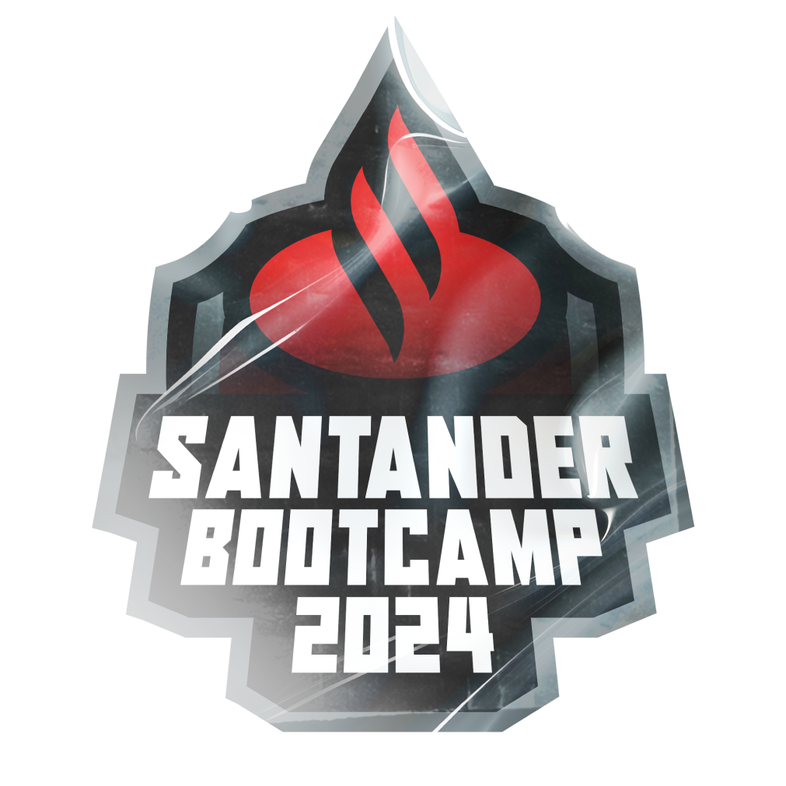

# Hey!

Bem vindo(a)!
este repositório foi criado com o intuito de relatar um pouco do meu andamento no bootcamp ofertado pelo Santander com foco em Java.
Meu nome é **Matheus Artur da Silva Santos** e eu tenho 24 anos de idade.
Eu sou de Recife, Pernambuco e atualmente estou cursando o terceiro período de ciências da computação na **UNINASSAU**.

#### CONTACTS

#### SKILLS

    
    
    
    
    
    
    
    
    

## :pushpin: SPRINTS

1. [Princípios de desenvolvimento de Software Colaborativo](Sprint_1) :heavy_check_mark:

2. [Dominando a Linguagem de Programação Java](Sprint_2) :construction: :construction_worker: :construction:

3. [Programação Orientada a Objetos com Java](Sprint_3) :construction: :construction_worker: :construction:

4. [Teste e Gerenciamento de Dependências em Projetos Java](Sprint_4) :construction: :construction_worker: :construction:

5. [Banco de Dados SQL e NoSQL Para Desenvolvedores Back-End](Sprint_5) :construction: :construction_worker: :construction:

6. [Ganhando Produtividade no Java com Spring Framework](Sprint_6) :construction: :construction_worker: :construction:

7. [Soft Skills na Era Ágil: Conectando Pessoas e Oportunidades](Sprint_7) :construction: :construction_worker: :construction: